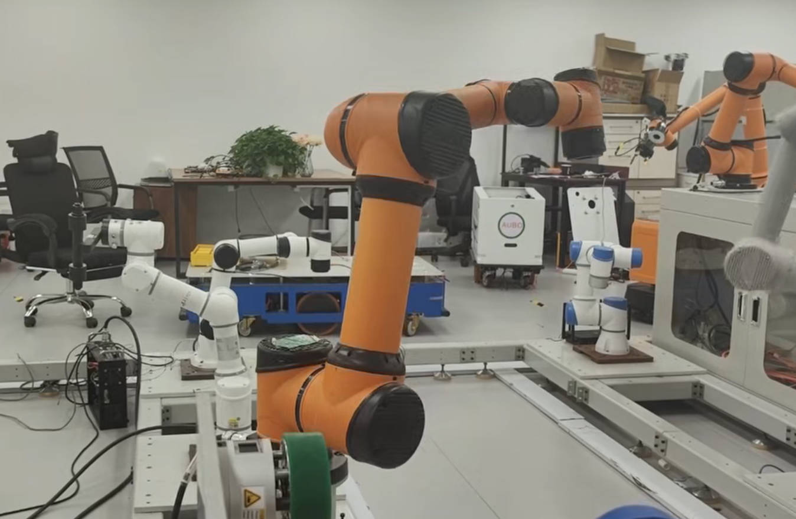

# AUBO i5H for Robonix

AUBO i5H 的 Robonix 部署仓库，包含机械臂 primitive、wave skill、本体模型和部署清单。
控制链路为 **Robonix → AUBO primitive → 官方 `pyaubo_sdk` → 控制柜**。



## 环境

- Ubuntu 22.04 x86_64、Python 3.10、ROS 2 Humble。
- Robonix 版本基线：`addb97dc9d9511f5994d9bbc86f32a1c85f32868`。
- SDK：`pyaubo_sdk==0.26.0rc6`，控制器接口版本 `0.26.0`。
- 配置对象：`aubo_i5H / rob1`。两份部署清单中的 `endpoint` 需指向实际控制柜。
  SDK 后端从该字段读取主机地址，实际使用 TCP `30004`；HTTP URL 格式为兼容配置保留。

已验证的驱动与 wave 源码原样保留；本包将现场 Docker 外层整理为原生启动脚本。
此次整理未执行构建、软件测试或实机测试，不将新的原生启动入口标为已经实机验证。

## 安装与启动

先按 [Robonix 安装说明](https://github.com/syswonder/robonix#quick-start)准备 Rust、uv 等构建依赖。
建议单独检出上述版本，避免与其他项目共用不同版本的 Robonix：

```bash
git clone --recursive https://github.com/syswonder/robonix.git
cd robonix
git checkout --detach addb97dc9d9511f5994d9bbc86f32a1c85f32868
git submodule update --init --recursive
make install
rbnx setup "$PWD"
```

在已安装 ROS 2 Humble 的机器上准备本仓库依赖，然后进入本仓库：

```bash
sudo apt-get install python3.10-venv ros-humble-rclpy ros-humble-sensor-msgs \
  ros-humble-geometry-msgs ros-humble-robot-state-publisher ros-humble-rmw-fastrtps-cpp
cd /path/to/robot-aubo-i5h
./build.sh
```

构建创建 `.venv`，安装 SDK 和 Python 依赖，并通过 `rbnx build` 生成接口；不会启动机器人。
使用独立私有文件提供 SDK 认证，JSON 字段为 `username`、`password`：

```bash
mkdir -p .runtime
install -m 600 /path/to/private/sdk-credentials.json .runtime/sdk-credentials.json
./start.sh
```

默认仅启用状态反馈。启动在前台运行，可用 Ctrl-C 或另一终端执行 `./stop.sh` 关闭部署。
需要命令接口和 wave 时，先关闭原部署，再启动运动配置：

```bash
AUBO_ENABLE_MOTION=1 ./start.sh motion
```

运动配置仅开放接口，不自动上电、启动控制器 Runtime 或发送运动目标。
上电及运行模式由现场操作员在控制柜侧准备。认证文件也可由 `AUBO_RPC_CREDENTIALS` 指定。
日志位于 `rbnx-boot/logs/`，驱动状态位于 `.runtime/arm-status.json`。
停止后再次 `./start.sh` 即以只读模式启动，不重放旧目标。

## 接口与模型

| Robonix contract | 含义 |
| --- | --- |
| `robonix/primitive/arm/joint_states` | 六关节反馈，rad / rad/s，10 Hz |
| `robonix/primitive/arm/end_pose` | `base_link` 下 TCP 位姿，m / xyzw |
| `robonix/primitive/arm/joint_command` | 带新时间戳的六关节命名位置目标 |
| `robonix/primitive/arm/pos_command` | TCP 目标，控制器 IK 后执行关节插补 |
| `robonix/skill/wave/wave` | MCP 技能，逐关节摆动，默认 ±0.3° |

共享 Driver 生命周期由 Robonix 管理。默认关节速度 0.03 rad/s、单次变化上限 0.05 rad、
TCP 位移上限 0.01 m，参数见运动清单。当前不提供直线/圆弧轨迹或碰撞规划。
URDF 包含此次集成机械臂的标定与 TCP；更换机械臂或 TCP 时应更新本体模型。

## 仓库与 PR

组织方式参考官方 [Ranger Mini 部署仓库](https://github.com/syswonder/robot-agilex-ranger_mini_v3)。
将本目录内容放在独立 GitHub 仓库根目录，建议仓库名 `robot-aubo-i5h`。
`primitives/`、`skills/` 是本仓库内的相对路径依赖，无需修改 Robonix 核心源码。

由提交人填写两份部署清单 `catalog.maintainers` 中的真实 `姓名 <邮箱>`，然后向
[robonix-package-catalog](https://github.com/syswonder/robonix-package-catalog)
提交 PR，在其现有 `catalog.yaml` 的 `robots:` 列表追加：

```yaml
- name: robonix.robot.aubo.i5h
  repo: https://github.com/<实际组织或账号>/robot-aubo-i5h
```

目录 PR 仅包含上述条目，源码留在机器人仓库。源代码许可与模型来源见 [NOTICE.md](NOTICE.md)。
